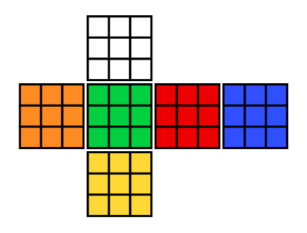

# Getting started

## The array

The array of the cube is represented this way:

```
[
  [[[0, 0, 0], [0, 0, 1], [0, 0, 2]],
   [[0, 1, 0], [0, 1, 1], [0, 1, 2]],
   [[0, 2, 0], [0, 2, 1], [0, 2, 2]]],

  [[[1, 0, 0], [1, 0, 1], [1, 0, 2]],
   [[1, 1, 0], [1, 1, 1], [1, 1, 2]],
   [[1, 2, 0], [1, 2, 1], [1, 2, 2]]],

  [[[2, 0, 0], [2, 0, 1], [2, 0, 2]],
   [[2, 1, 0], [2, 1, 1], [2, 1, 2]],
   [[2, 2, 0], [2, 2, 1], [2, 2, 2]]],
  
  [[[3, 0, 0], [3, 0, 1], [3, 0, 2]],
   [[3, 1, 0], [3, 1, 1], [3, 1, 2]],
   [[3, 2, 0], [3, 2, 1], [3, 2, 2]]],

  [[[4, 0, 0], [4, 0, 1], [4, 0, 2]],
   [[4, 1, 0], [4, 1, 1], [4, 1, 2]],
   [[4, 2, 0], [4, 2, 1], [4, 2, 2]]],

  [[[5, 0, 0], [5, 0, 1], [5, 0, 2]],
   [[5, 1, 0], [5, 1, 1], [5, 1, 2]],
   [[5, 2, 0], [5, 2, 1], [5, 2, 2]]]
]
```

For instance the list `[0, 0, 0]` represents `[color, row, column]`.
The colors are determined as:
- 0 for white
- 1 for orange
- 2 for green
- 3 for red
- 4 for blue
- 5 for yelllow

## Visualizing the array

Therefore, we can represent the array above as:



# `Cube` class from main module

### Methods

`Cube()` class contains several useful functions in simulating the cube.
- `turn_front()`: F
- `turn_front_prime()`: F'
- `turn_right()`: R
- `turn_right_prime()`: R'
- `turn_left()`: L
- `turn_left_prime()`: L'
- `turn_up()`: U
- `turn_up_prime()`: U'
- `turn_down()`: D
- `turn_down_prime()`: D'
- `turn_back()`: B
- `turn_back_prime()`: B'
- `display_letter()`: display cube in letters
- `display_array()`: display array
- `scramble(notations=str)`: scramble cube

### Attributes

The class also has few attributes that may be useful in simulating the cube.
- `cube_array`: contains 4-dimensional array of the cube with the shape of (6, 3, 3, 3)
- `scramble_notations`: string of the scramble used in `scramble` method

### Demo

The class can be accessed in such way

```py
import rubiks

# initializing the class
mycube = rubiks.Cube()

# scramble the cube
mycube.scramble("R U R' U R U2 R'")

# display the cube
mycube.display_letter()

# output: 
    GWW
    WWW
    RWB
WBB WGO WOO GRR
OOO GGG RRR BBB
OOO GGG RRR BBB
    YYY
    YYY
    YYY
```

<br>

> Feel free to suggest features and improvements.
